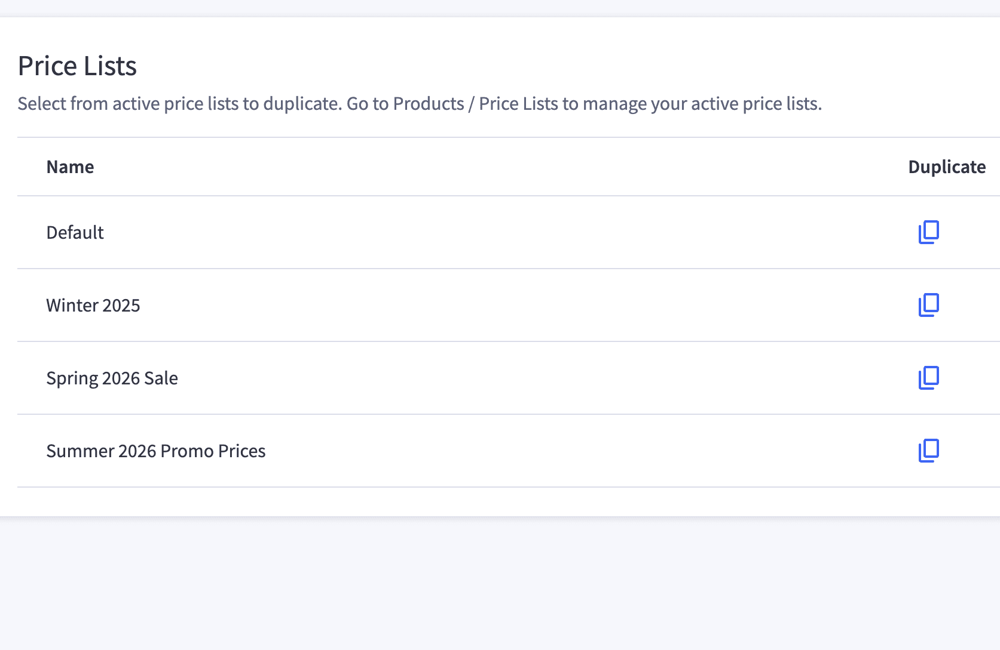
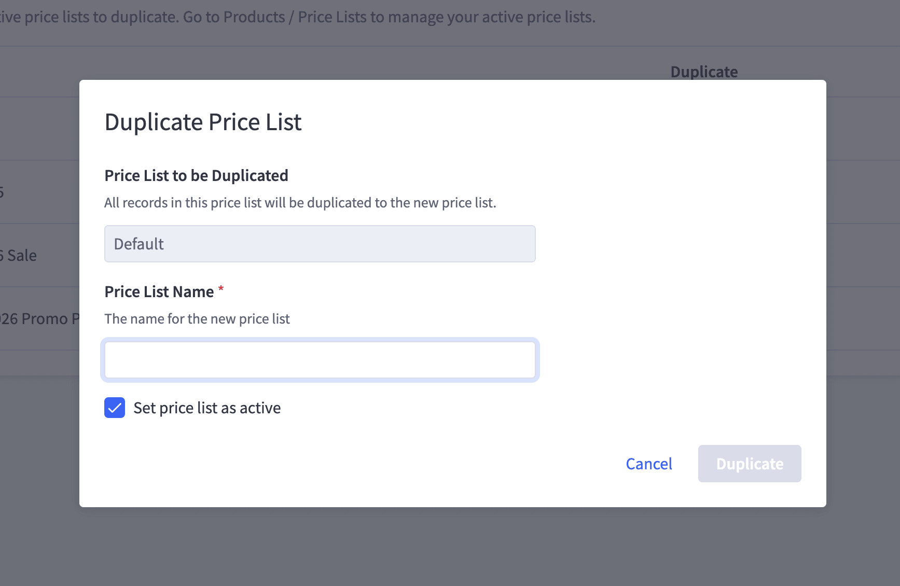

# Bigcommerce pricelist duplicator

## App Details
A simple app for making copies of a Price List. Building a new price list with a small number of changes -- copy an existing one with one click! The new price list will contain all the same records as the original, but the customer group assignments remain unchanged.

#### Permissions Required

- *Product Read/Write* - required to read and write Price Lists and Price List Records

## User Guide

### Overview

**Price List Duplicator** is a simple, powerful tool that allows BigCommerce store users to duplicate any active price list in their store. You can:

- Select any active price list from your store
- Provide a new name for the duplicated list
- Choose whether the new price list should be active immediately
- All price list records (pricing entries) are copied to the new list
- Customer group or channel assignments are **not** changed — they remain tied to the original list

---

### Features

✅ Duplicate any active price list  
✅ Rename the new price list  
✅ Copy all price records into the new list  
✅ Choose whether the duplicated list is active  
✅ Assignments are left unchanged  

---

### Getting Started

#### 1. View Your Active Price Lists

When you open the app, you'll see a list of all active price lists in your BigCommerce store.

Each row includes the name of the price list and a **Duplicate** icon button on the right-hand side.

---

#### 2. Click the Duplicate Button

Click the icon next to the price list you'd like to copy.

This opens a modal where you can:

- Confirm which price list you're duplicating
- Enter a name for the new list
- Choose whether or not the new list should be **active**

---

#### 3. Fill Out the Duplicate Form

- **Price List to be Duplicated** — pre-filled with the original list name (read-only)
- **Price List Name** — required; the name for the new duplicated price list
- **Set price list as active** — optional; check this box to enable the new list immediately

> Note: Assignments (e.g. customer groups or channels) are **not duplicated**. Only the pricing records are copied into the new list.

---

#### 4. Submit

Click **Duplicate** to create the new price list.

- You will see the new price list in your BigCommerce admin
- All pricing records from the original list will be copied over
- The new price list will be **active** or **inactive** depending on your selection

---

### Support

For questions or help using the app, contact **Aligent** at:  
📧 app.support@aligent.com.au

---

© Aligent. All rights reserved.
